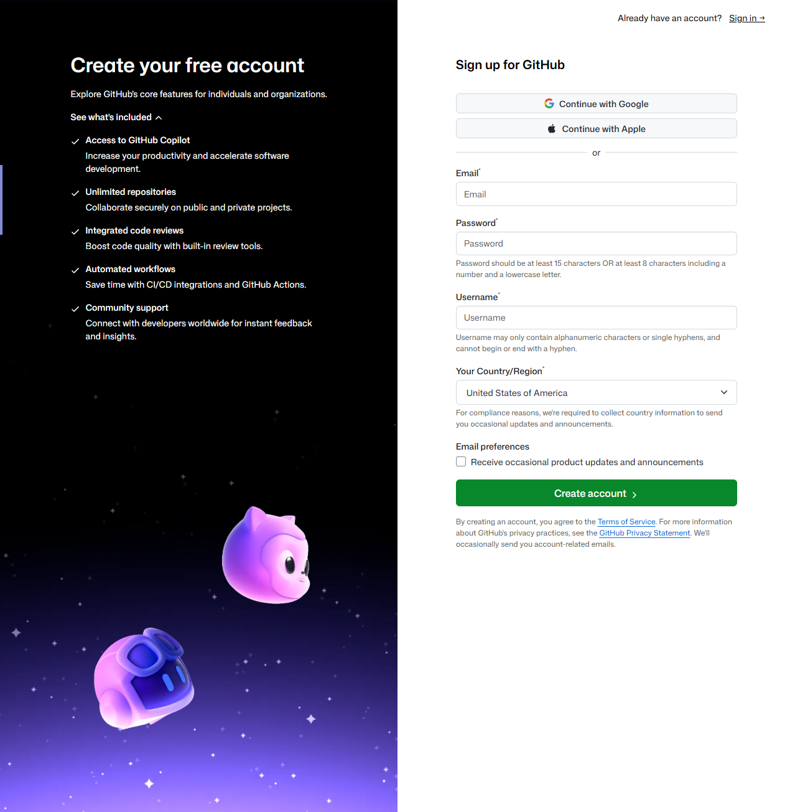
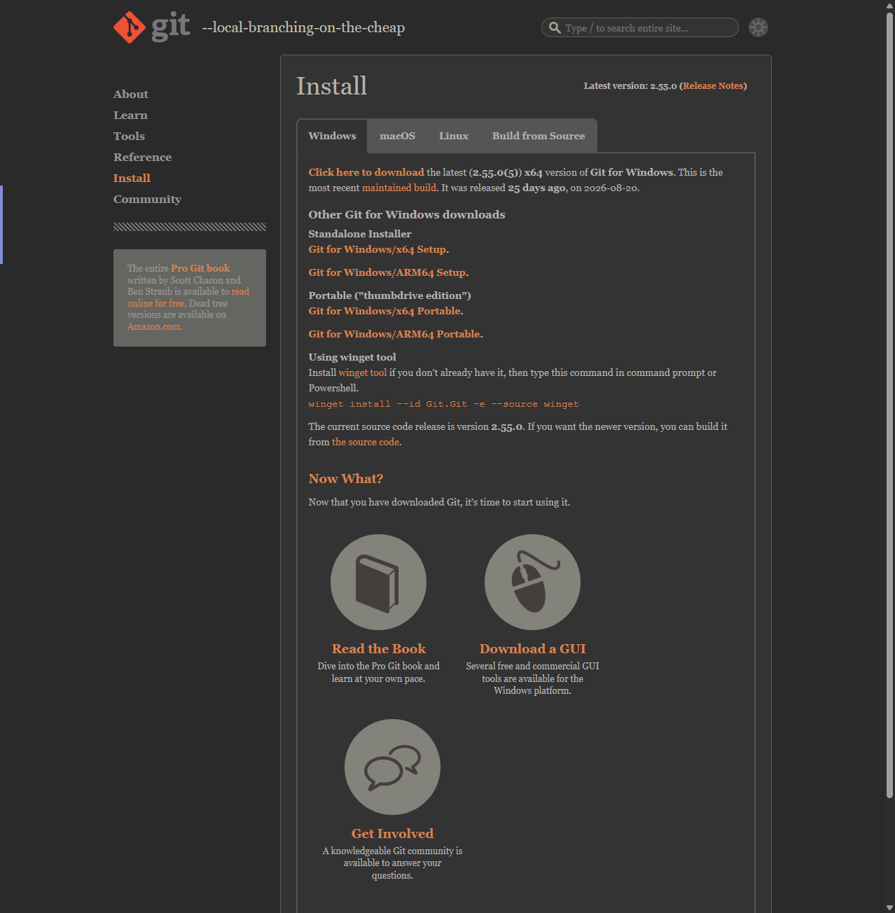
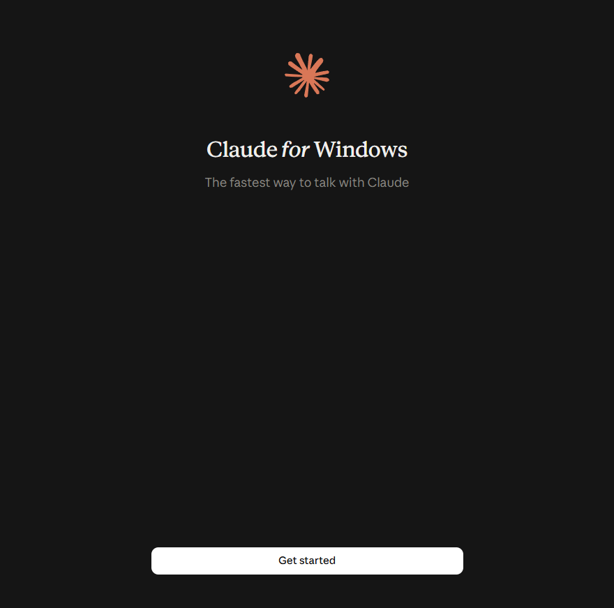
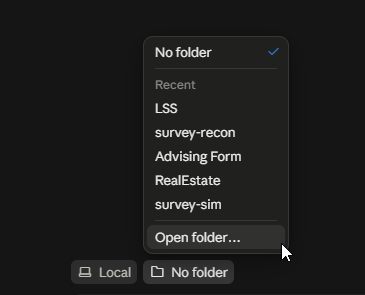
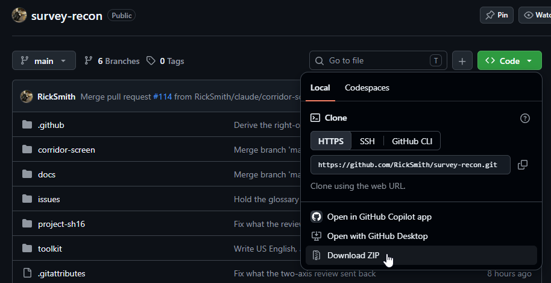
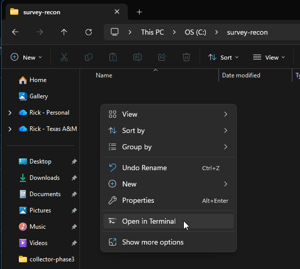
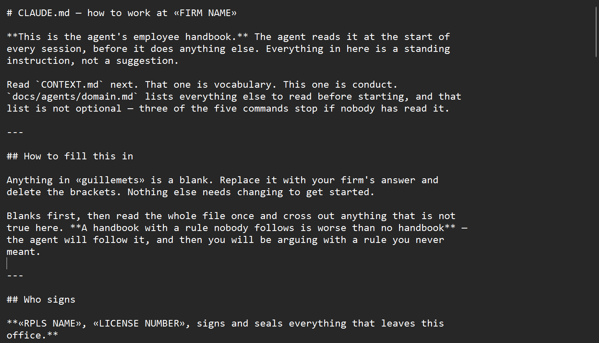
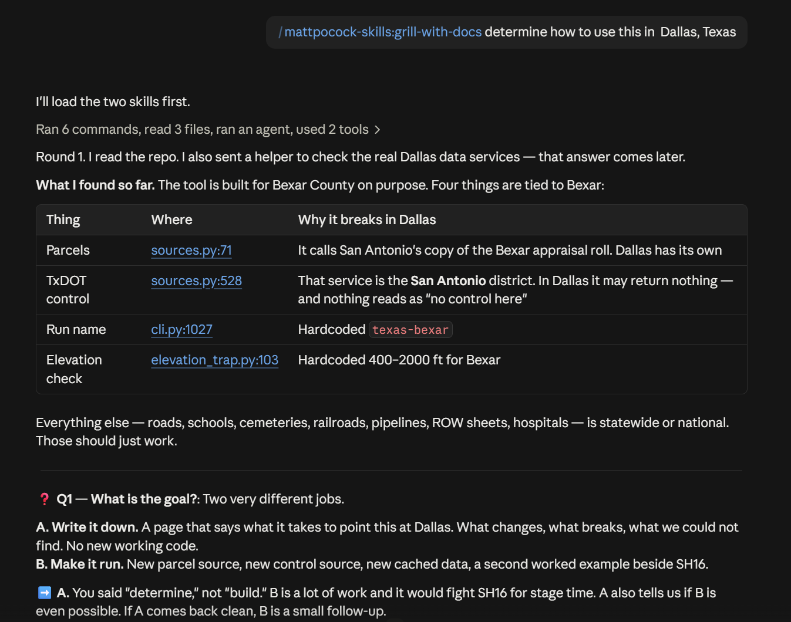
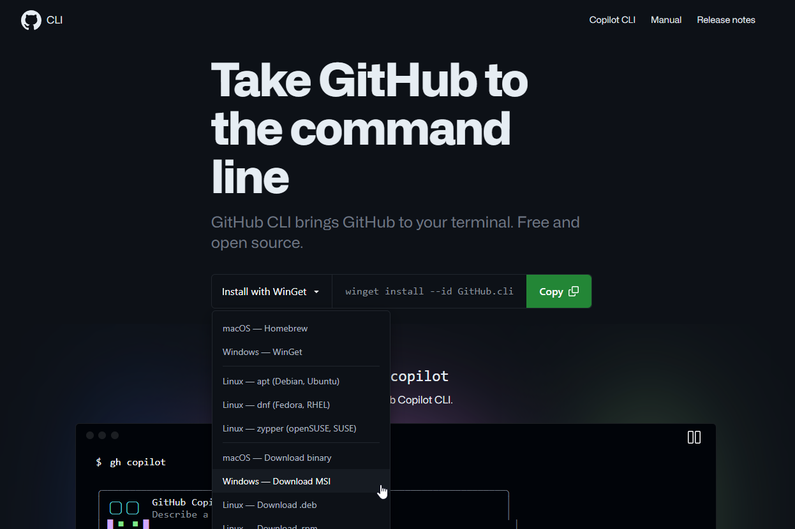

# Day 0: Setup

**Three things to install, about half an hour, and no programming.** At the end
you will have an agent that reads your firm's rules before it starts work, and
five commands that carry a job from "somebody wants something" to "you signed
it."

You do not need to have used a command line before. Where this page asks you to
type something, it gives you the exact line and says what it does.

!!! tip "If you would rather install nothing"
    [For principals](../for-principals/index.md) is one page, with no terminal on
    it, written for deciding rather than doing. Come back here when you have
    somebody to point at it.

---

## What you need

| | What it does for you | Where it comes from |
|---|---|---|
| **A GitHub account** | Holds the work orders and the check prints | <https://github.com/signup> |
| **git** | Keeps every version of every file, so no change is ever lost | <https://git-scm.com/downloads> |
| **The Claude desktop app** | The agent itself | <https://claude.ai/download> |

There is a fourth thing that is not a download: **a Claude account, on a plan
that covers the app's coding side.** The app tells you which plan you are on.
This page does not quote a price — prices change, and a stale number on a page
nobody updates is worse than no number at all.

**Nothing on this page needs Node, npm, Docker, Python, or an API key.** That is
deliberate. The usual way to install the five commands needs the first three of
those, so they are copied into this repo as plain text instead.
[The toolkit page](../toolkit/index.md) says what that cost.

---

## Step 1 — Make a GitHub account

GitHub is where the work orders live. In survey terms it is the job file: every
work order, every revision, and every check print in one place, with a date and a
name on each one.

Go to <https://github.com/signup> and work through the form. It asks for an email
address, a password, and a username. The username is public, so use something you
would put on a business card.

!!! info "Screenshot 1 — the GitHub sign-up page"
    

    **Shows:** the sign-up form as it first loads, with nothing typed into it,
    so a reader can match the page in front of them against the page on this
    one.

GitHub emails you a code and asks you to type it back. If the email does not
arrive within a minute or two, check the junk folder before asking for another
one — a second request usually makes the first code stop working.

!!! info "Screenshot 2 — the email verification step"
    **Not captured yet.** Must show: the screen asking for the code from the
    email. This is where people stop and wonder whether the sign-up failed.

That is the whole account. You do not need to create anything inside it today.

---

## Step 2 — Install git

git is the thing that keeps every version of every file. Nothing you do with an
agent overwrites the last good copy, because git still has it.

Three words you will meet, in survey terms:

- A **branch** is a working copy nobody else is affected by
- A **commit** is a field book entry
- A **pull request** is the check print you redline

Download git from <https://git-scm.com/downloads> and pick your operating system.

!!! info "Screenshot 3 — the git download page"
    

    **Shows:** the download page with the Windows button visible, and the
    version number beside it.

### On Windows

The installer asks a long series of questions. **The default answer is the right
answer for every one of them.** Click through and accept what is already
selected.

Two screens worry people, so they are worth naming before you meet them:

- One asks about your **PATH** — that is the list of places Windows looks when
  you type a command. Leave the middle option selected, which is the default
- One asks which **editor** git should use. The default is a text editor that is
  hard to quit if you have never met it. If you are offered a choice you
  recognize, such as Notepad, take it. Nothing on this page will open it either
  way

!!! info "Screenshot 4 — the installer page about your PATH"
    **Not captured yet.** Must show: the whole installer window on the PATH page,
    with the default middle option selected, so a reader can compare without
    reading the words.

!!! info "Screenshot 5 — the installer page about the default editor"
    **Not captured yet.** Must show: the drop-down list of editors, open, with
    the default showing.

### On a Mac

Open Terminal and type `git --version`, then press return. If git is already
there, it prints a version number and you are finished with this step. If it is
not, macOS offers to install it for you. Say yes.

```bash
git --version
```

!!! info "Screenshot 6 — the macOS offer to install developer tools"
    **Not captured yet.** Must show: the dialog macOS puts up the first time you
    type `git`, with its Install button.

---

## Step 3 — Install the Claude desktop app

Download it from <https://claude.ai/download>, install it, and sign in with the
Claude account from the top of this page.

!!! info "Screenshot 7 — the app's sign-in screen"
    

    **Shows:** the sign-in screen as the app first opens.

The app has more than one side to it. The side this repo uses is the one that
works on a folder of files on your own machine, rather than on a conversation.
That is the side that can read your job folder, write into it, and run the five
commands.

!!! info "Screenshot 8 — where the app opens a folder"
    

    **Shows:** the app's coding side, with the control that picks a folder
    clearly visible, and no real file names in the window.

**Decide now what you will and will not hand it.** Whatever you give the agent
goes to a company's servers, so treat it the way you would treat an email leaving
the firm. The checklist of
[what never leaves the office](../governance/what-never-leaves.md) is the place
to settle that, and filling it in is the part of this setup with real
consequences.

---

## Step 4 — Get this repo onto your machine

A **repository**, or repo, is a folder that git is keeping the history of. This
one holds the worked example, the data sources, and the `toolkit` folder you are
about to copy.

The quickest way to get it is to download the whole thing as a zip file. Go to
[the repo on GitHub](https://github.com/RickSmith/survey-recon), press the green
button near the top of the file list, and choose **Download ZIP**. Unzip it
somewhere you can find again.

!!! info "Screenshot 9 — the green button and the Download ZIP entry"
    

    **Shows:** the green button pressed, with the menu open and Download ZIP
    visible in it.

If you already know how to use git for this, use git. The zip is here because it
is one click and needs nothing explained first.

---

## Step 5 — Make a job folder and copy the toolkit in

Make a folder for the job you want to work on. An empty one is fine.

!!! warning "Keep the path short"
    Put it somewhere like `C:\jobs\sh16`.

    A folder inside OneDrive, inside a firm name with spaces in it, inside
    Documents, inside three more folders, gets past the 260 characters Windows
    opens without being asked. When that happens the failure does not say "the
    path is too long" — it says the file does not exist, which sends you looking
    for the wrong problem. This repo carries a piece of code that exists only
    because of this.

Now copy the **contents** of the `toolkit` folder into your job folder. Not the
folder itself — what is inside it.

### Opening a command line in that folder

On Windows 11, open the job folder in File Explorer, right-click an empty part of
the window, and choose **Open in Terminal**. That gets you a command line already
pointed at the right folder, so nothing on this page has to explain how to change
directories.

If that entry is not in the menu, hold **Shift** and right-click again. Older
Windows keeps it out of the plain menu.

!!! info "Screenshot 10 — opening a command line in the job folder"
    

    **Shows:** the Windows 11 right-click menu over an empty part of a folder
    window, with the entry that opens a terminal there highlighted.

On a Mac, right-click the folder and use the Finder service that opens Terminal
at that folder.

### The command

On Windows, with the path to where you unzipped the repo in place of
`<path-to>`:

```powershell
Copy-Item -Path "<path-to>\survey-recon\toolkit\*" -Destination . -Recurse -Force
```

On a Mac:

```bash
cp -R <path-to>/survey-recon/toolkit/. .
```

!!! danger "Do not drag these across by hand"
    One of the folders you are copying is called `.claude`, and it is the one
    that carries the five commands. A name starting with a dot is treated
    differently by both systems:

    - **On a Mac, Finder hides it.** You cannot select what you cannot see.
      `Cmd`-`Shift`-`.` shows hidden files if you want to look
    - **On Windows, File Explorer shows it**, but it sorts away from the files
      you are looking at and is easy to leave out of a selection

    Either way the first sign of getting it wrong is the app saying it does not
    know the command you just typed.

    **The Windows command above was run and checked on 2026-09-13**, on Windows
    11 with PowerShell 5.1: `.claude` came across with everything else. The macOS
    command is `toolkit/README.md`'s own, and has not been re-run here.

When it has worked, the top of your job folder looks like this:

```
your-job-folder/
├── .claude/
│   └── skills/
├── docs/
│   └── agents/
├── CLAUDE.md
├── CONTEXT.md
└── README.md
```

---

## Step 6 — Fill in `CLAUDE.md` and `CONTEXT.md`

**You now have somebody else's agent. This step makes it yours.**

Two of the files you just copied have blanks in them. Anything in «guillemets» is
one. Open them in any text editor — Notepad is fine.

**`CLAUDE.md`** is the employee handbook, and it wants three things: your firm
name, who signs, and the list of what never leaves the office. That last list is
the one with real consequences, and the
[checklist](../governance/what-never-leaves.md) is there to work through.

**`CONTEXT.md`** is the glossary. It wants six words you are tired of explaining.
Six is plenty for a first version — it grows on its own, and the first command
you run adds to it as terms get settled.

!!! info "Screenshot 11 — the handbook with its blanks still in it"
    

    **Shows:** `CLAUDE.md` open in a plain text editor with at least one
    «guillemet» blank visible, so a reader knows what they are looking for.

Everything else in the folder can wait.

---

## Step 7 — Check that it worked

Open the Claude desktop app, point it at your job folder, and type:

```
/grill-with-docs
```

If it starts interviewing you about the job — what the corridor is, who the
client is, what you already have — everything is wired up correctly.

!!! info "Screenshot 12 — the agent answering the command"
    

    **Shows:** the app with `/grill-with-docs` typed and the first interview
    question on screen. Use a made-up job, not a real one.

!!! note "The picture shows a longer name than you will type"
    Look closely and the shot reads `/mattpocock-skills:grill-with-docs`. It was
    taken on a machine where these five commands were installed as a plugin, and
    the app puts the plugin's name in front of anything that arrives that way.

    **Yours came out of the folder you copied, so yours has no prefix. Type
    `/grill-with-docs`.** Both run the same procedure.

If instead it says it does not know that command, the `.claude` folder did not
come across. Go back to step 5 and use the command rather than dragging.

**That interview is the step that earns the other four commands.** It is the same
twenty minutes you already spend on the phone before you quote a job. An agent
that starts work before the scope is settled produces a confident, fast, wrong
answer, in much the way a new hire does.

---

## Optional — GitHub CLI, for work orders on GitHub

This one is genuinely optional, and it is the only thing on this page that is a
fourth install rather than one of the three.

The toolkit is set up to keep work orders as GitHub issues, and that needs
[GitHub CLI](https://cli.github.com) — one program, no Node and no account beyond
the one you made in step 1. Somebody in your firm may still have to approve
installing it.

**If that is a problem, skip it.** The toolkit also describes keeping work orders
as plain files in the job folder, which needs nothing at all. See
[`issue-tracker.md`](https://github.com/RickSmith/survey-recon/blob/main/toolkit/docs/agents/issue-tracker.md)
in the kit.

!!! info "Screenshot 13 — the GitHub CLI download page"
    

    **Shows:** the download page with the Windows installer link visible.

---

## When it does not work

| What you see | What it usually is |
|---|---|
| The app does not know `/grill-with-docs` | The `.claude` folder did not come across. Step 5 |
| A file "does not exist" that you can see in File Explorer | The path is too long. Move the job folder to `C:\jobs\` and try again |
| `git` is not recognized as a command | The git installer did not finish, or the machine has not been restarted since |
| The verification email never arrives | Check junk. Ask for a new code only after that, since a new one stops the old one working |
| The agent answers, but talks about no firm in particular | `CLAUDE.md` still has its blanks in it. Step 6 |

**This table is short on purpose, and it is meant to grow.** It lists what has
actually stopped somebody, not everything that could. When a step stops you, the
fix belongs here — that is
[issue #9](https://github.com/RickSmith/survey-recon/issues/9), where one
surveyor walks this page cold and every place they get stuck gets fixed rather
than explained away.

---

## What next

- **[The toolkit](../toolkit/index.md)** — what each of the five commands does,
  and the order they run in
- **[Managing your agent](../managing-your-agent/index.md)** — the supervision
  loop, using this repo's own mistakes as the worked example
- **[The worked example](../scenarios/sh16/index.md)** — a real TxDOT right of
  way job on SH16, start to finish, from public data

**You accept the work. Not the agent.** Everything after this page is about that
one sentence.
