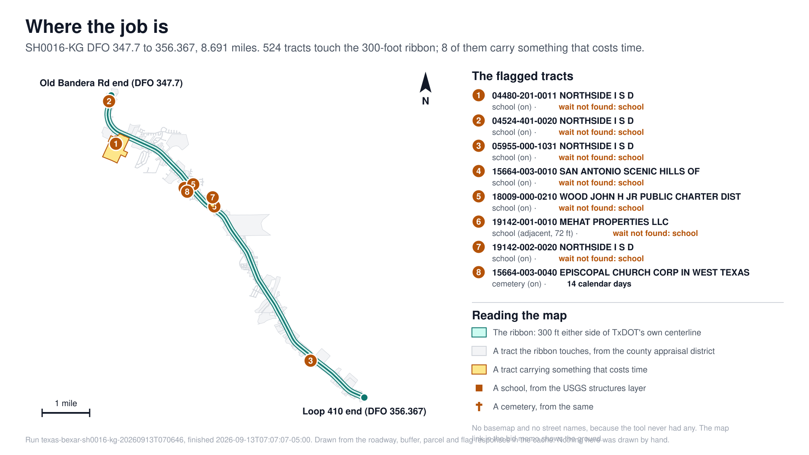
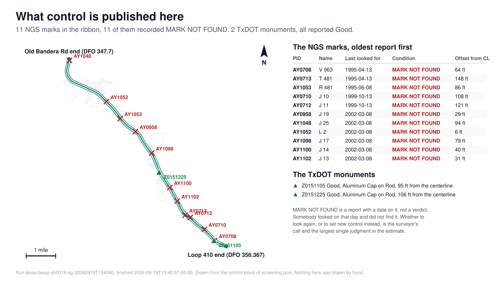
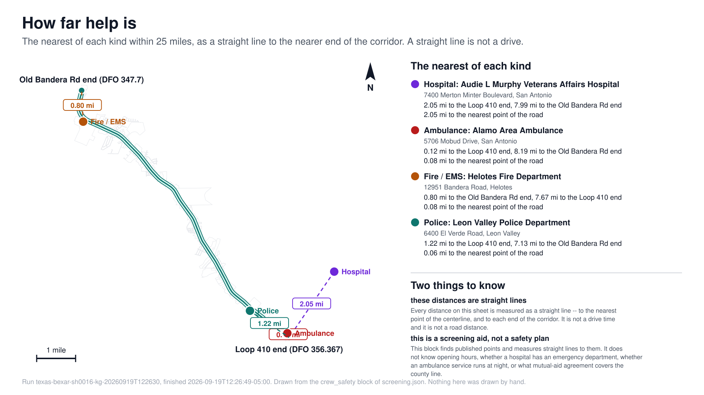
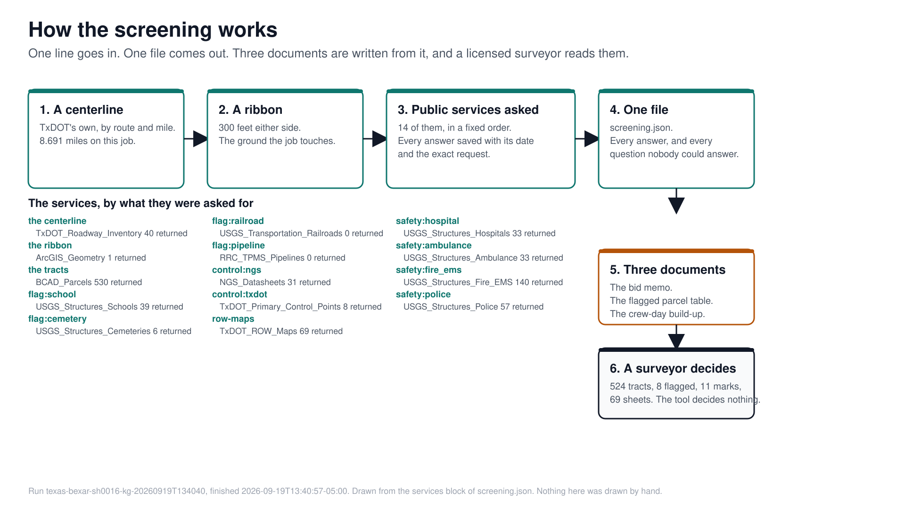
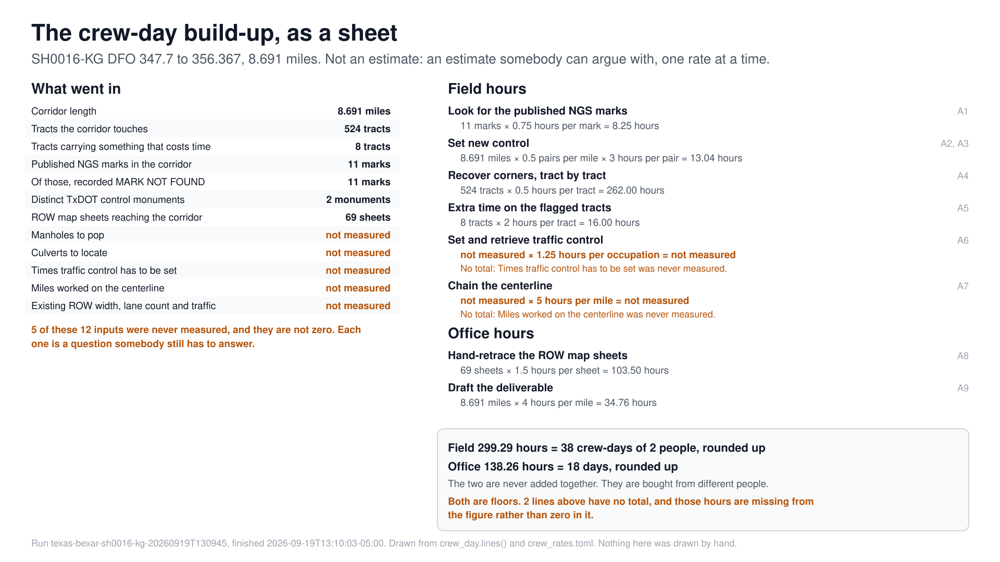

# The worked example — SH16, Bexar County

!!! note "Placeholder"
    This page is a stub. **The capture is done, and so are all three outputs
    built on top of it** — under
    [#22](https://github.com/RickSmith/survey-recon/issues/22),
    [#23](https://github.com/RickSmith/survey-recon/issues/23) and
    [#24](https://github.com/RickSmith/survey-recon/issues/24).

    What the tool found, and every surprise it turned up, is on
    [What the capture found](capture-note.md). The memo built from that run is
    [`project-sh16/bid-memo.md`](https://github.com/RickSmith/survey-recon/blob/main/project-sh16/bid-memo.md).
    The flagged parcel table is
    [`project-sh16/flagged-parcels.md`](https://github.com/RickSmith/survey-recon/blob/main/project-sh16/flagged-parcels.md),
    with its projector drawing beside it at
    [`flagged-parcels.svg`](https://github.com/RickSmith/survey-recon/blob/main/project-sh16/flagged-parcels.svg).
    The crew-day build-up is
    [`project-sh16/crew-day.md`](https://github.com/RickSmith/survey-recon/blob/main/project-sh16/crew-day.md),
    with a plain-text fallback beside it at
    [`crew-day.txt`](https://github.com/RickSmith/survey-recon/blob/main/project-sh16/crew-day.txt)
    for a podium where Python will not start.

TxDOT SH16 (Bandera Rd), Loop 410 to Old Bandera Rd. Preliminary design ROW mapping,
widening on both sides. One corridor, start to finish: find the control, count
the tracts, flag what costs time, and build an estimate you can defend.

Everything here comes from public data. No client data, ever.

## The job, drawn

Every drawing below was made from the run itself. Nothing on them was drawn by
hand, and every number is one the run recorded.

**Where the job is.** The centerline, the 300-foot ribbon, all 524 tracts, and
the eight tracts that carry something that costs time.

**What control is published here.** Eleven NGS marks, every one recorded
`MARK NOT FOUND`, and two TxDOT monuments reported in good condition.

**How far help is.** The nearest hospital, ambulance, fire station and police
station, as straight lines to the nearer end of the corridor. A straight line
is not a drive.

**How the screening works.** A centerline goes in, a ribbon is drawn, fourteen
public services are asked, one file comes out, and three documents are written
from it.

**The crew-day build-up, as a sheet.** What went in, the arithmetic line by
line, and the two lines that have no total shown as having no total.

Each drawing is a plain text file you can open, and each one names the run it
came from. The command that draws them is in the
[corridor-screen README](https://github.com/RickSmith/survey-recon/blob/main/corridor-screen/README.md#the-drawings).
